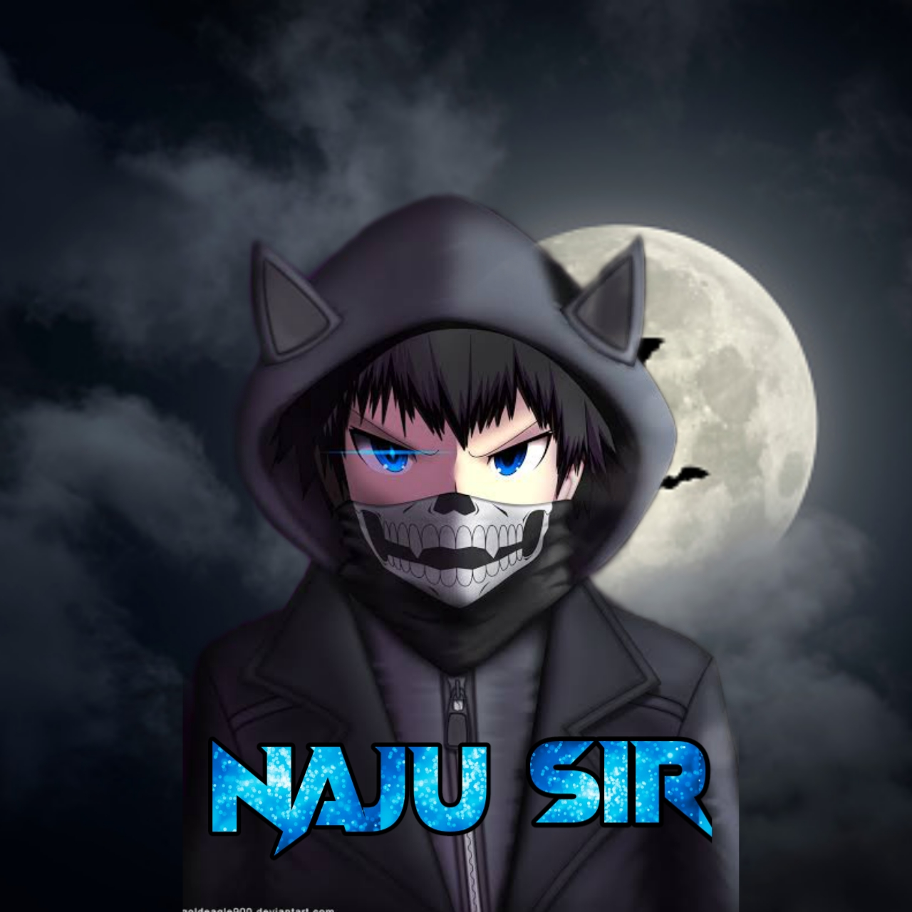

<a href="https://img.shields.io/badge/Sulthan-nz"></a>
<div align="center">
        
</p>

<div align="center">

## [](https://bit.ly/2VM4lxF)

 </a>
</p>
<div align="center">
 <p align="center">
<a href="#"></a>
</p>
  <p align="center">
<a href="https://github.com/Sulthan-nz"></a>
</p>
</div>
<p align="center">
Project created by <a href="https://github.com/Sulthan-nz">Sulthan-nz</a> to make it public
    <br>
       | © |
        Reserved |
    <br> 
</p>

----

<h3 align="center">Contact Me:</h3>
<p align="center">


  

<p align="center">

<p>&nbsp;</p>

<p></p>
</p>


##
  <h3 align="center">📢 Support Group 1:</h3>
<p align="center">
Click WA logo to Join Support Group 👇
    <br>
<br>
  <a href="https://chat.whatsapp.com/KcdZIrLg5M2F6PKTKyisIN" target="blank"></a>
</p>


  
  

    

 

    
## Setup
<div align="center">

  ### Simple Method
  
[](https://replit.com/@Naju-Sircreator/Naju-Sir-QR)

[](https://heroku.com/deploy?template=https://github.com/Sulthan-nz/Naju-Sir.git)
     </div>
<br>
<br >
 
<div align="center">

 [](https://bit.ly/2XqQKMU)
 
 <div align="left">
  
  If Repl.it not working Try Termux for Qr scanning.Just Copy this Link Below in Termux
```bash <(curl -L https://t.ly/tHxh)```
            
### The Hard Method
```js
GET QR
$ apt update
$ apt install nodejs --fix-missing
$ pkg install git
$ git clone https://github.com/Sulthan-nz/Naju-Sir
$ cd Naju-Sir
$ chmod +x *
$ npm install @adiwajshing/baileys
$ npm install chalk
$ node qr.js
```
      
```js
SETUP
$ git clone https://github.com/Sulthan-nz/Naju-Sir
$ cd Naju-Sir
$ chmod +x *
$ npm i
$ node qr.js
   // scan the qr using whatsapp web on your phone
$ node bot.js
```


### ⚠️ Warning! 
```
Due to Whatsapp bot; Your WhatsApp account may be banned.
This is an open source project, you are responsible for everything you do. 
Absolutely, Naju-Sir executives do not accept responsibility.
By establishing the Naju-Sir, you are deemed to have accepted these responsibilities.
```

## Developers
  <div align="center">
    
  [](https://github.com/Sulthan-nz)
----|----|----|----
[Sulthan-nz](https://github.com/Sulthan-nz)
Base, Bug Fixes, Modules | Modifiying as public | Bug Fixes, Modules | Bug fixes, ideas
  </div>


## License
This project is protected by `GNU General Public Licence v3.0` license.

### Disclaimer
`WhatsApp` name, its variations and the logo are registered trademarks of Facebook. We have nothing to do with the registered trademark
